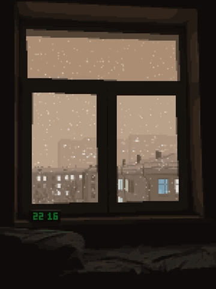

  

    
  

 

  <h2>About me 🐲 </h2>
   

    
  

  <ul>
    <li>💊 My name is Zhenya</li>
    <li>📕  I'm currently studying at 11 grade. </li>
    <li>👾 My hobbies are coding, learning english and music </li>
    <li>🍤 I'm just a beginner </li>
  </ul>

## My skills 🛠️
#### Programming languages

  

